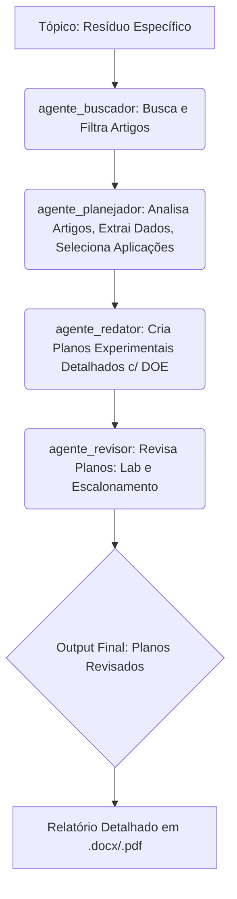

# Time-de-Agentes-Pesquisadores-Engenheiros: Um Time Digital para Inovação em Materiais a partir de Resíduos 🔥🔬♻️

## Acelerando a Pesquisa em Valorização de Resíduos (e Além!)

### O Desafio: Transformar Resíduos em Riquezas não é Trivial

O sonho de transformar resíduos em materiais valiosos é fundamental para um futuro sustentável. No entanto, a jornada da ideia à bancada do laboratório é repleta de desafios:

* **Sobrecarga de Informação:** A vasta literatura científica sobre o assunto é esmagadora.
* **Curadoria da Qualidade:** Identificar artigos relevantes, metodologias sólidas e dados confiáveis exige tempo e expertise.
* **Planejamento Experimental:** Traduzir insights da pesquisa em um plano de laboratório prático, detalhado e estatisticamente robusto (DOE) requer conhecimento específico.
* **Viabilidade e Escalonamento:** Validar se um processo funciona em bancada é uma coisa; avaliar seu potencial de escalonamento e praticidade é outra.

Pesquisadores dedicam horas a essas tarefas, que, embora essenciais, podem ser otimizadas.

### A Solução: Uma Equipe de Agentes de IA Colaborativos

É aqui que entra o Projeto Sinergia IA. Desenvolvemos uma "equipe dos sonhos" de quatro agentes de Inteligência Artificial, cada um com uma especialidade única, trabalhando em conjunto dentro do ambiente do Google Colab para automatizar e aprimorar o processo de pesquisa e planejamento experimental focado na valorização de resíduos.

Não se trata apenas de automação; é **sinergia**. A força do sistema reside na colaboração fluida entre os agentes, onde a saída de um se torna a entrada refinada para o próximo, culminando em um plano de ação concreto e revisado por pares "artificiais".

### Conheça a Equipe 🤖🤝

Nossa forja digital é operada por quatro agentes especializados:

1.  🔬 **agente_buscador (O Olheiro Acadêmico):**
    * **Missão:** Vasculhar a literatura científica (últimos 10 anos) para encontrar as aplicações e métodos mais promissores para um resíduo específico.
    * **Habilidade Chave:** Filtra por relevância, impacto (citações/fator de impacto) e, crucialmente, por artigos com metodologias bem definidas e aplicações claras. Gera insights iniciais sobre cada artigo.
    * **Entrega:** Uma lista curada dos artigos mais relevantes com detalhes essenciais e justificativa.

2.  🧠 **agente_planejador (O Estrategista Sênior):**
    * **Missão:** Analisar profundamente os artigos fornecidos pelo `agente_buscador`, validar sua solidez científica, extrair detalhes da metodologia e identificar os parâmetros de processo chave.
    * **Habilidade Chave:** Atua como um revisor crítico, aprofunda na extração de dados de processo (temperatura, tempo, proporções, etc.) e seleciona as 2-3 aplicações mais promissoras para desenvolvimento em laboratório, incluindo um potencial "overdelivery".
    * **Entrega:** Relatórios detalhados por artigo válido e a seleção justificada das aplicações prioritárias.

3.  🧪 **agente_redator (O Arquiteto Experimental):**
    * **Missão:** Traduzir as aplicações e parâmetros selecionados pelo `agente_planejador` em planos experimentais detalhados e prontos para a bancada de laboratório.
    * **Habilidade Chave:** Expert em Design de Experimentos (DOE) e procedimentos de laboratório. Elabora passo a passos claros, define fatores, níveis, respostas, materiais, equipamentos e critérios de sucesso, como um roteiro para alunos de iniciação científica e técnicos.
    * **Entrega:** Planos experimentais completos para as aplicações selecionadas, incluindo sugestão de DOE e procedimento detalhado.

4.  🏭 **agente_revisor (O Engenheiro de Processos Pragmático):**
    * **Missão:** Avaliar os planos experimentais do `agente_redator` sob a ótica da praticidade de laboratório (executabilidade, segurança, reprodutibilidade) e do potencial de escalonamento industrial.
    * **Habilidade Chave:** Identifica gargalos, riscos, complexidades e avalia a viabilidade preliminar para uma escala maior, garantindo que o que funciona em pequena escala *pode* ter um futuro na indústria.
    * **Entrega:** Uma revisão crítica com aprovação ou sugestões de melhoria no plano e procedimento, adicionando a valiosa perspectiva da engenharia de processos.

### O Fluxo de Trabalho Sinergético 🌐➡️📄

O processo é um pipeline orquestrado:



### Funcionalidades e Vantagens ✨

* **Pesquisa Acelerada:** Passa de um tópico a um plano experimental em tempo recorde.
* **Curadoria Inteligente:** Foco em artigos de alta qualidade e relevância prática.
* **Dados Estruturados:** Extração clara de parâmetros de processo.
* **Planejamento Robusto:** Incorporação automática de princípios de Design de Experimentos.
* **Validação Cruzada:** O agente_revisor adiciona uma camada crucial de praticidade e visão de escalonamento.
* **Output Pronto para Uso:** Geração de relatórios completos em formatos Microsoft Word (.docx) e PDF (.pdf), facilitando o compartilhamento e a execução em laboratório.
* **Reproducibilidade:** Os planos detalhados promovem a padronização dos experimentos.

### Por Que Isso é Importante (Muito Além dos Resíduos!) 🚀

Este projeto é mais do que uma ferramenta para resíduos; é uma **prova de conceito poderosa** para a automação de *qualquer* fluxo de pesquisa acadêmica que envolva:

* Revisão sistemática da literatura.
* Extração de dados e parâmetros chave.
* Planejamento experimental baseado em evidências.
* Revisão prática e de escalonamento.

A estrutura de agentes especializados e colaborativos pode ser facilmente adaptada para outras áreas da ciência e engenharia (descoberta de fármacos, síntese química, otimização de processos, etc.), democratizando o acesso a expertise e acelerando a fronteira do conhecimento.

Estamos construindo o futuro da pesquisa, uma equipe de agentes por vez!

### Começe aqui 🛠️

Para utilizar o Time-de-Agentes-Pesquisadores-Engenheiros e gerar seus próprios planos experimentais a partir de um resíduo, siga estes passos no Google Colab:

1.  **Acesse o Notebook:** Abra o notebook principal do projeto (`Time-de-Agentes-Pesquisadores-Engenheiros`) no Google Colab. Você precisará de uma conta Google para acessá-lo.


2.  **Configure o Ambiente e Instale Dependências:** Uma vez no notebook, execute a primeira célula de código. Esta célula é responsável por:
    * Configurar o ambiente Python.
    * Instalar todas as bibliotecas Python necessárias que os agentes utilizam (ex: para chamadas à API do Google Search, manipulação de dados, geração de arquivos .docx e .pdf, etc.).
    * Você verá algo como:
        ```bash
        !pip install -q pandas requests python-docx reportlab # Adicione aqui suas libs reais
        # Outras configurações iniciais, se houver
        ```

3.  **Execute o Pipeline dos Agentes:** Agora, execute as células subsequentes do notebook em sequência. Cada célula, ou um grupo delas, invocará a lógica de um dos agentes (`agente_buscador`, `agente_planejador`, `agente_redator`, `agente_revisor`) na ordem correta.
    * Você pode executar as células uma por uma para acompanhar cada etapa do processo.
    * Alternativamente, após definir o resíduo e instalar as dependências, você pode usar a opção "Executar tudo" do Colab (no menu "Ambiente de execução") para rodar o pipeline completo.
    * Aqui você pode se sentir livre para editar as instruções conforme lhe for conveniênte desde que siga a lógica adotada no fluxograma anterior.

4.  **Defina o Resíduo de Interesse:** Execute as células que definem os papeis dos agentes.  Encontre a célula no notebook onde o tópico do resíduo é definido. Edite a string com o nome ou descrição do resíduo para o qual você deseja buscar aplicações e criar um plano experimental (ex: `"borra de café"`, `"cinzas de casca de arroz"`, `"plástico PET pós-consumo"`).


5.  **Acesse os Relatórios Finais:** Ao final da execução, o `agente_revisor` (ou a etapa final do pipeline) irá gerar os relatórios completos contendo os planos experimentais detalhados nos formatos Microsoft Word (.docx) ou PDF (.pdf).
    * Estes arquivos serão salvos no seu dispositivo.
   

Pronto! Agora você tem planos experimentais revisados e prontos para serem levados para a bancada do laboratório.

### Contribuições 🤝

Sugestões, feedbacks e comentários são extremamente bem vindos. Sou apenas um engenheiro de materiais entusiasmado com as oportunidade que a Alura me deu para aprender um pouco mais.

### Licença 📄

[Informação sobre a licença do código.]
